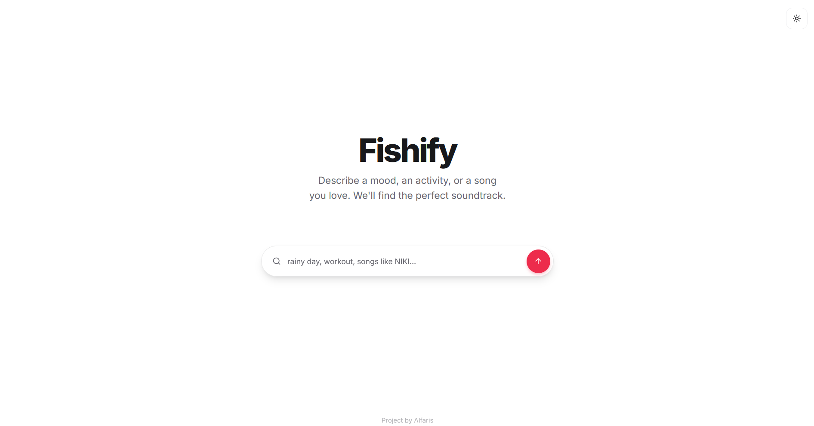
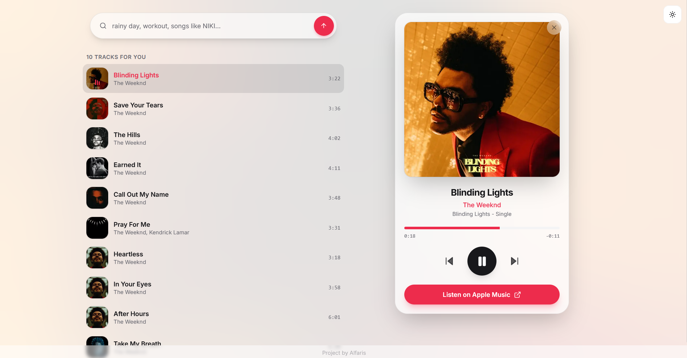

# Fishify — AI Music Recommender


**Fishify** turns plain language into a soundtrack. Describe a **mood**, an **activity**, or a **song/artist** you love, and an AI returns 10 curated tracks — each with album art, a 30-second preview, and an Apple Music link, wrapped in a sleek Apple Music–style interface.

> Example: type `rainy day`, `workout`, or `songs like NIKI` → get a listenable list in seconds.

---

## Screenshots

|                     Home                      |                       Results                       |
| :-------------------------------------------: | :-------------------------------------------------: |
|  |  |

---

## Features

- **Natural-language search** — prompt with a mood, activity, artist, or vibe.
- **Instant previews** — built-in 30-second audio player with prev / play / next.
- **Apple Music–style UI** — ambient artwork backdrop, now-playing card, animated equalizer on the active track.
- **Light & dark themes** — toggle in the top-right, dark by default.
- **One-tap open** — jump straight to the full track on Apple Music.
- **Zero music-API cost** — uses the free public iTunes Search API (no key, no auth, no premium).

---

## How It Works

A **Next.js frontend**, an **AI backend powered by Genkit + Groq**, and the **free iTunes Search API**:

1. **User input** — you enter a prompt (e.g. `"music for a rainy day"`) and hit search.
2. **AI request (Genkit + Groq)** — the prompt goes to a server action; a Groq LLM (`llama-3.3-70b`) interprets it and returns 10 song titles + artists.
3. **iTunes enrichment** — for each suggestion, the app queries the iTunes Search API for:
   - Album cover art
   - Apple Music track link
   - Song duration
   - 30-second preview URL (when available)
4. **Display** — results render as a list with a now-playing player for previews.

---

## Tech Stack

| Layer | Tech |
|-------|------|
| Frontend | Next.js (App Router), React, TypeScript |
| Styling | Tailwind CSS, shadcn/ui |
| AI | Genkit + Groq (`llama-3.3-70b-versatile`) |
| Music data | iTunes Search API (free, no key) |
| Deployment | Vercel |

---

## Getting Started

### 1. Prerequisites
- Node.js 18+
- A free **Groq API key** — [console.groq.com](https://console.groq.com) → **API Keys** → **Create API Key**

### 2. Install
```bash
git clone https://github.com/alfarissm/fishify_new.git
cd fishify_new
npm install
```

### 3. Configure environment
Create a `.env.local` file in the project root:
```bash
GROQ_API_KEY=gsk_your_key_here
```
> The iTunes Search API needs **no** key. `GROQ_API_KEY` is the only variable required.

### 4. Run
```bash
npm run dev
```
Open [http://localhost:9002](http://localhost:9002).

---

## Environment Variables

| Variable | Required | Description |
|----------|----------|-------------|
| `GROQ_API_KEY` | Yes | Groq API key for AI recommendations |

That's it — iTunes is public, so there are no music-service credentials.

---

## Deploy to Vercel

1. Import the repo at [vercel.com/new](https://vercel.com/new).
2. **Settings → Environment Variables** → add `GROQ_API_KEY` (Production + Preview).
3. Deploy.

Image artwork from Apple (`*.mzstatic.com`) is already whitelisted in `next.config.ts`. New env values only take effect after a redeploy.

---

## Prompt Ideas

- `music to help me focus`
- `songs like Arctic Monkeys`
- `calm music for night drives`
- `energetic music for working out`
- `melancholic indie tracks`

---

## Limitations

- **Preview length is fixed by Apple** — clips are ~30 seconds (some ~90s) and the player caps at 30s. Full songs require an Apple Music subscription; use the "Listen on Apple Music" button.
- **Not every track has a preview** — those without one are skipped or shown as *"preview not available"*.
- **AI training cutoff** — the Groq model only knows music up to its training date, so very recent releases may not appear.
- **Groq free-tier rate limits** — under heavy traffic the AI request can hit a `429` rate limit; results then fail until it resets.
- **Best-match enrichment** — iTunes returns the closest match per title, so an occasional remaster or alternate version may be picked. Suggestions not found on iTunes are dropped.
- **No personalization** — recommendations come from your text prompt only, not your listening history.

---

**Enjoy discovering music with Fishify.**
